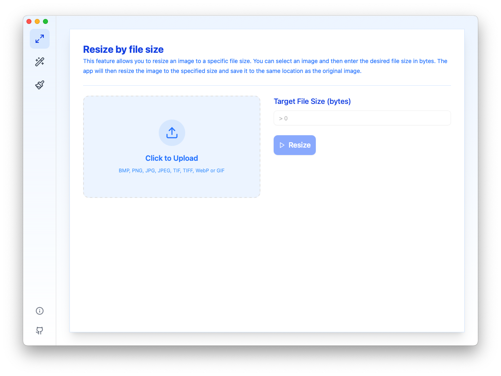
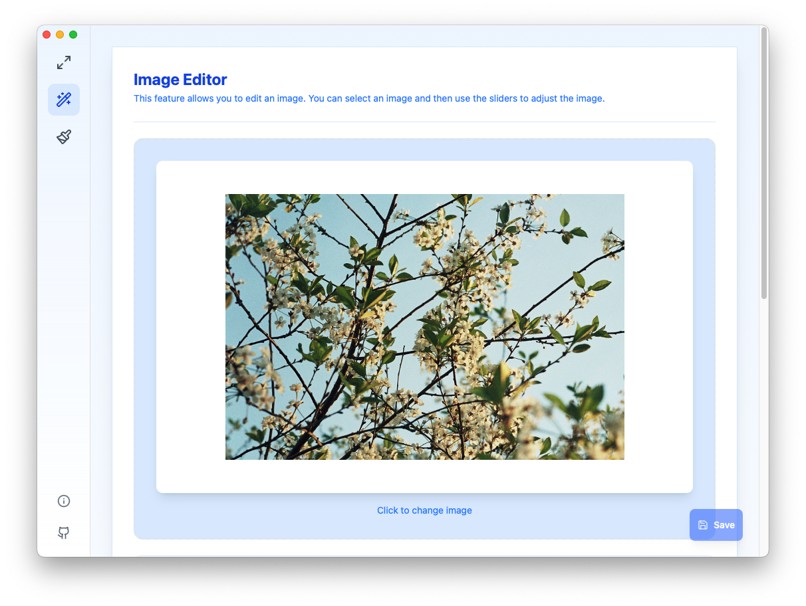
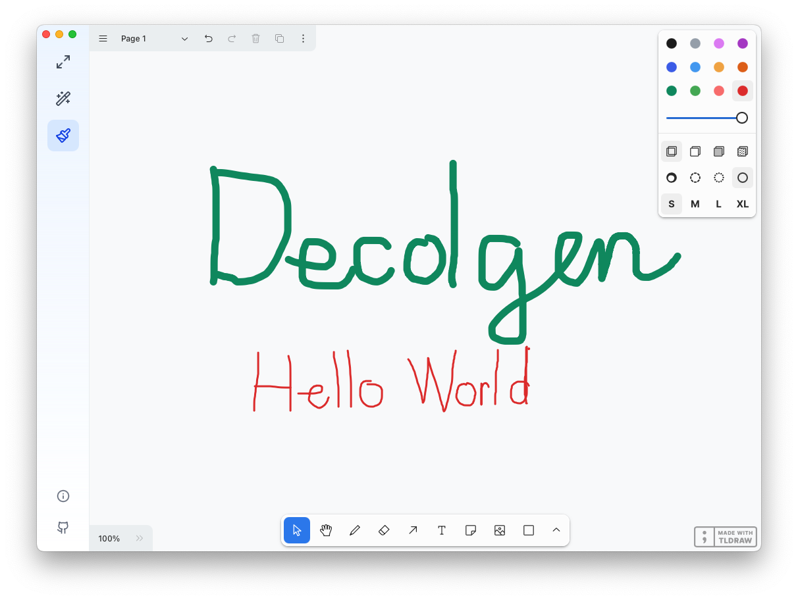

# Decolgen

A powerful desktop application for image manipulation, built with modern web technologies. Decolgen combines image resizing capabilities with advanced drawing and editing features.

## Description

Decolgen is a modern desktop application that provides powerful tools for image manipulation and drawing. It offers an intuitive user interface and a comprehensive set of features for both basic and advanced image editing needs.

### Key Features

#### Image Resizing

- **Resize by File Size**: Automatically adjust image dimensions to meet specific file size requirements
- **Resize by Dimensions**: Precisely control image width and height
- **Maintain Aspect Ratio**: Optional aspect ratio preservation
- **Multiple Format Support**: JPG, PNG, GIF, BMP, TIFF, WebP



#### Image Generation & Editing

- **Advanced Filters**: Multiple resampling algorithms (Nearest Neighbor, Linear, CatmullRom, Lanczos)
- **Image Adjustments**:
  - Blur and Sharpening
  - Gamma Correction
  - Contrast and Brightness
  - Saturation Control
  - Color Inversion
- **Real-time Preview**: Instant visual feedback for all adjustments



#### Drawing Tools (powered by tldraw)

- **Freehand Drawing**: Natural drawing experience
- **Shapes**: Rectangle, circle, arrow, and more
- **Text Annotation**: Add and style text
- **Image Annotations**: Insert and manipulate images
- **Multiple Pages**: Create multi-page documents
- **Undo/Redo**: Full history support



## Tech Stack

- [Wails](https://wails.io/) - Desktop application framework
- [React](https://reactjs.org/) - UI framework
- [TypeScript](https://www.typescriptlang.org/) - Type-safe JavaScript
- [Tailwind CSS](https://tailwindcss.com/) - Utility-first CSS
- [shadcn/ui](https://ui.shadcn.com/) - UI components
- [tldraw](https://www.tldraw.com/) - Drawing functionality
- [Lucide Icons](https://lucide.dev/) - Beautiful icons
- [Sonner](https://sonner.emilkowal.ski/) - Toast notifications

## Prerequisites

Before you begin, ensure you have the following installed:

- [Go](https://golang.org/) (1.18 or later)
- [Node.js](https://nodejs.org/) (18 or later)
- [pnpm](https://pnpm.io/) (8 or later)
- [Wails CLI](https://wails.io/docs/gettingstarted/installation)

## Installation

1. Clone the repository:

   ```bash
   git clone https://github.com/iamphong/decolgen.git
   cd decolgen
   ```

2. Install frontend dependencies:

   ```bash
   cd frontend
   pnpm install
   ```

3. Install Go dependencies:
   ```bash
   cd ..
   go install github.com/wailsapp/wails/v2/cmd/wails@latest
   go mod tidy
   ```

## Development

1. Start the development server:

   ```bash
   wails dev
   ```

2. The application will open automatically. Any changes to the frontend code will trigger hot reload.

## Building

To build the application for production:

```bash
wails build
```

The built application will be available in the `build/bin` directory.

## Contributing

Contributions are welcome! Please feel free to submit a Pull Request. For major changes, please open an issue first to discuss what you would like to change.

## License

[MIT License](LICENSE)

## Acknowledgments

- [Wails](https://wails.io/) for the amazing desktop framework
- [tldraw](https://www.tldraw.com/) for the powerful drawing functionality
- [shadcn/ui](https://ui.shadcn.com/) for the beautiful UI components
